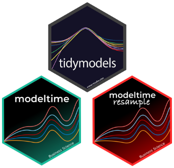

<style>
body {text-align: justify}
</style>

```{r setup, include=FALSE}
knitr::opts_chunk$set(echo = TRUE,
                      message = FALSE,
                      warning = FALSE,
                      fig.width = 12,
                      fig.height = 4,
                      fig.align = "center")
```

# Pendahuluan

<i>Time Series Forecasting</i> merupakan salah satu model dari <i>Supervised Machine Learning</i>, yang memiliki kemampuan untuk memprediksi sebuah nilai di masa depan berdasarkan data historis khususnya data-data yang berhubungan dengan waktu. 

Pada bahasa pemrograman R sendiri, sudah banyak sekali <i>framework</i> ataupun <i>packages</i> yang dapat kita manfaatkan untuk membuat sebuah model <i>time series forecasting</i>. Dari sekian banyak framework dan packages, pada artikel ini kita akan fokus untuk melakukan eksplorasi terhadap sebuah <i>framework</i> yang masih menjadi keluarga dari `Tidymodels` yaitu <i>framework</i> `modeltime` dan sebuah package tambahan yaitu `modeltime.resample`.

<b> Kenapa Menggunakan <i>modeltime</i>?</b>

```{r, echo=F}

```

Salah satu alasan utama kenapa fokus dari artikel ini membahas `modeltime` karena `modeltime` adalah sebuah <i>framework</i> yang berisikan beberapa <i>model machine learning time series</i>, dari yang cukup klasik seperti <i>ARIMA</i> dan <i>Exponential Smooting</i>, sampai dengan yang cukup baru seperti <i>Facebook’s Prophet</i> dan <i>parnship</i>. 

Selain itu, `modeltime` menyediakan sebuah <i>workflow</i> yang dapat kita manfaatkan sebagai panduan. Berikut adalah urutak <i>workflow</i> yang dapat kita ikuti:

* <b>Tahapan 1 - Persiapan Data</b>: Pada tahapan pertama ini akan mencangkup proses pengumpulan data, pembersihan data dan eksplorasi terhadap data kita.
* <b>Tahapan 2 - <i>Cross Validation</i></b>: Tahapan kedua yang harus dilakukan adalah memisahkan data kita menjadi data pembelajaran dan data evaluasi, proses pemisahan data tersebut nantinya bisa dibantu oleh package `modeltime.resample` yang masih menjadi keluarga dari `modeltime`. 
* <b>Tahapan 3 - Mempersiapkan <i>Model Machine Learning</i></b>: Tahapan ketiga adalah tahapan dimana kita akan membuat <i>model machine learning time series</i>. Dikarenakan `modeltime` memiliki berbagai macam model yang dapat kita gunakan, tentu saja kita dapat membuat beberapa model sekaligus.
* <b>Tahapan 4 - Menggabungkan Model Ke Sebuah Tabel</b>: Jika kita membuat beberapa model sekaligus, kita dapat menggabungkan beberapa model tersebut ke sebuah tabel agar lebih rapi dan lebih mudah untuk dibandingkan pada tahapan berikutnya.
* <b>Tahapan 5 - Prediksi & Evaluasi</b>: Tahapan selanjutnya adalah melakukan prediksi terhadap data evaluasi dan melakukan evaluasai terhadap hasil prediksinya.
* <b>Tahapan 6 - Prediksi Masa Depan</b>: Tahapan terakhir yang dapat kita lakukan adalah memilih salah satu model yang paling baik dari hasil evaluasi yang sudah dilakukan dan mengimplementasikan model tersebut untuk memprediksi masa depan.

Tentu saja ebagai seorang <i>Data Scientist</i> kita akan sangat terbantu karena kita sudah memiliki sebuah <i>framework</i> yang memungkinkan kita untuk bekerja lebih cepat dan rapi. 

# Library

```{r}
# Data Wrangling
library(tidyverse)
library(lubridate)

# Data Visualisasi
library(timetk)

# Machine Learning
library(tidymodels)
library(modeltime)
library(modeltime.resample)
```

# Modeltime Workflow

## Persiapan Data

Seperti yang sudah disampaikan di atas, pada tahapan pertama ini akan dimulai dengan proses pengumpulan data, pembersihan data dan eksplorasi data.

### Pengumpulan Data

Data yang akan digunakan di sini adalah data yang berasal dari [kaggle](https://www.kaggle.com/djzurawski/us-oil-and-gas-production-june-2008-to-june-2018).

```{r}
crude_oil <- read.csv("data_input/U.S._crude_oil_production.csv")
crude_oil 
```

Dari total 36 kolom yang terdapat pada dataframe di atas, kita hanya akan menggunakan 2 kolom saja yaitu kolom `Month` dan `U.S..Crude.Oil`. Kolom `Month` berisikan informasi tanggal setiap awal bulan dari Juni 2008 sampai September 2018 dan pada kolom `U.S..Crude.Oil` berisikan informasi jumlah hasil tambang minyak bumi dari setiap daerah di Amerika Serikat dalam satuan 1000 barel, jumlah hasil tambang minyak bumi pada kolom `U.S..Crude.Oil` berdasarkan penjumlahan dari 34 kolom lainnya. 

### Pembersihan Data

Tahapan selanjutnya yang perlu kita lakukan adalah mempersiapkan data kita agar dapat diproses lebih lanjut. Proses pembersihan yang akan dilakukan terlebih dahulu adalah menghilangkan kolom yang tidak diperlukan dan mengubah tipe data menjadi format yang lebih sesuai.

```{r}
crude_oil_clean <- crude_oil %>% 
  select(Month, U.S..Crude.Oil) %>% 
  mutate(Month = ymd(Month)) 

glimpse(crude_oil_clean)
```

Selain melakukan dua proses di atas, kita juga harus memastikan bahwa tidak ada <i>missing value</i> pada data kita karena jika adanya <i>missing value</i> akan sangat mempengaruhi hasil prediksi.

```{r}
crude_oil_clean %>% 
  is.na() %>% 
  colSums()
```

Dari hasil observasi di atas, kita mengetahi bahwa pada data kita tidak ada <i>missing value</i>. 

### Eksplorasi Data

Untuk mempermudah tahapan eksplorasi data untuk kasus deret waktu, kita akan membuat sebuah visualisasi garis dengan menggunakan fungsi `plot_time_series` dari `library(timetk)`. 

Hasil dari visualisasi tersebut nantinya akan sangat membantu kita untuk mengetahui apakah hasil tambang minyak bumi di Amerika Serikat memiliki sebuah pola arah atau pola musiman. Jika nantinya dari hasil visualisasi ternyata data deret waktu tidak memiliki pola arah atau pola musiman, maka dapat dikateogrikan sebagai data stasioner dan jika memiliki entah sebuah pola arah atau pola musiman, maka dapat dikategorikan sebagai data tidak stasioner.

Identifkasi mengenai kategori data pada kasus deret waktu merupakan hal yang penting karena akan menentukan pendekatan yang akan digunakan nantinya. 

```{r}
crude_oil_clean %>%
  plot_time_series(.date_var = Month, 
                   .value = U.S..Crude.Oil, 
                   .line_size = 1, 
                   .smooth_size = 0.5,
                   .smooth_alpha = 0.4,
                   .interactive = TRUE, 
                   .x_lab = "Tanggal", 
                   .y_lab = "Jumlah Minyak Bumi (1000 Barel)", 
                   .title = "Hasil Tambang Minyak Bumi Amerika Serikat (Juni 2008 - September 2018)")
```

Dari hasil visualisasi di atas, kita bisa menarik kesimpulan bahwa data hasil tambang minyak bumi di Amerika Serikat tidak memiliki pola musiman tapi memiliki pola arah yang cenderung meingkat dari waktu ke waktu, maka dari itu data tersebut dapat dikategorikan sebagai data tidak stasioner.

## Cross Validation


```{r}
resamples_tscv <- time_series_cv(
    data        = crude_oil_clean,
    assess      = "1 year",
    initial     = "5 years",
    skip        = "1 year",
    slice_limit = 4
)
```

Agar mendapatkan gambaran yang lebih jelas lagi, kita dapat melihat bagaimana hasil dari metode <i>Cross Validation</i> dalam melakukan pembagian data menjadi ke 4 kurun waktu yang berbeda untuk setiap data pembelajaran dan data validasinya dari visualisasi di bawah ini.

```{r}
resamples_tscv %>%
    tk_time_series_cv_plan() %>%
    plot_time_series_cv_plan(.date_var = Month, 
                             .value = U.S..Crude.Oil, 
                             .facet_ncol = 4, 
                             .interactive = TRUE)
```

## Machine Learning Model

```{r}
model_fit_arima_no_boost <- arima_reg() %>%
    set_engine(engine = "auto_arima") %>% 
    fit(U.S..Crude.Oil ~ Month, data = crude_oil)
```

```{r}
model_fit_arima_boosted <- arima_boost(
    min_n = 2,
    learn_rate = 0.015
) %>%
    set_engine(engine = "auto_arima_xgboost") %>%
    fit(U.S..Crude.Oil ~ Month + as.numeric(Month) + factor(month(Month, label = FALSE), ordered = F),
        data = crude_oil)
```


```{r}
model_fit_prophet <- prophet_reg() %>%
    set_engine(engine = "prophet") %>%
    fit(U.S..Crude.Oil ~ Month, data = crude_oil)
```

```{r}
model_fit_ets <- exp_smoothing() %>%
    set_engine(engine = "ets") %>% 
    fit(U.S..Crude.Oil ~ Month, data = crude_oil)
```

```{r}
model_fit_lm <- linear_reg() %>%
    set_engine("lm") %>%
    fit(U.S..Crude.Oil ~ as.numeric(Month) + factor(month(Month, label = FALSE), ordered = FALSE),
        data = crude_oil)
```


## Penggabungan Machine Learning Model

```{r}
models_tbl <- modeltime_table(
    model_fit_arima_no_boost,
    model_fit_arima_boosted,
    model_fit_prophet,
    model_fit_ets,
    model_fit_lm
)

models_tbl
```

```{r}
resamples_fitted <- models_tbl %>%
    modeltime_fit_resamples(
        resamples = resamples_tscv,
        control   = control_resamples(verbose = FALSE)
    )

resamples_fitted
```


## Prediksi & Evaluasi

```{r}
resamples_fitted %>%
    plot_modeltime_resamples(
      .point_size  = 3, 
      .point_alpha = 0.8,
      .interactive = TRUE
    )
```

```{r}
resamples_fitted %>%
    modeltime_resample_accuracy() %>%
    table_modeltime_accuracy(.interactive = FALSE)
```


## Prediksi Masa Depan

```{r}
refit_tbl <- resamples_fitted %>%
    modeltime_refit(data = crude_oil)

refit_tbl %>%
    modeltime_forecast(h = "3 years", actual_data = crude_oil) %>%
    plot_modeltime_forecast(
      .legend_max_width = 25, # For mobile screens
      .interactive      = TRUE
    )
```


# Kesimpulan


<b>Referensi:</b>

1. [Getting Started With Modeltime](https://business-science.github.io/modeltime/articles/getting-started-with-modeltime.html)
2. [Getting Started With Modeltime Resample](https://business-science.github.io/modeltime.resample/articles/getting-started.html)


